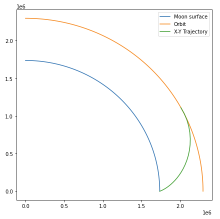

# Astrophysics Almanack
Library that includes models for dynamics and equations of motion of different physics dynamics, aircraft flight dynamics, rocket equations, and orbital mechanics.
It also includes practical exercises and utils (optimization algorithms and orbital mechanics main solvers and functions).

 

 

# Content & Structure
* Physics Equations of Motion
  * [Atmospheric Model (EOM)](/1-Physics-Equations-of-Motion/AtmosphericModel.py)
  * [Free Fall Motion (EOM)](/1-Physics-Equations-of-Motion/FreeFallMotion.py)
  * [Parabolic Motion (EOM)](/1-Physics-Equations-of-Motion/ParabolicMotion.py)
* Aircraft Flight Dynamics
  * [Aircraft Aerodynamic Forces](/2-Aircraft-Flight-Dynamics/AircraftAerodynamicForces.py)
  * [Aircraft Flight Dynamics](/2-Aircraft-Flight-Dynamics/AircraftFlightDynamics.py)
* Rocket Science
  * [Rocket Lunar Ascent](/3-Rocket-Science/Rocket_LunarAscent.py)
  * [Rocket Lunar Ascent - Optimal Control](/3-Rocket-Science/Rocket_LunarAscent_Optimization.ipynb)
* Astrophysics & Orbital Mechanics
  * [Satellite Orbital Motion](/4-Astrophysics-Orbital-Mechanics/SatelliteOrbitalMotion.py)
  * [Orbital Rendezvous](/4-Astrophysics-Orbital-Mechanics/Orbital_Rendezvous.py)

* Exercises
  * [Orbital Mechanics Exercises](/exercises)
* Utils
  * Orbital Mechanics Functions
    * [Orbital Elements from Perigee and Apogee](/utils/orbital-mechanics/OEfromZpZa.py)
    * [State Vector at t from Initial State Vector](/utils/orbital-mechanics/SVfromSV0.py)
    * [Orbital Mechanics Library](/utils/orbital-mechanics/orbital_mechanics_algorithms_library.py)
  * Optimization Algorithms
    * [Optimization Algorithms](/utils/optimization/optimization_algorithms.m)
    * [Optimization - Gradient Method (fixed step)](/utils/optimization/optimization_gradient_fixedstep.m)
    * [Optimization - Gradient Method (optimal step)](/utils/optimization/optimization_gradient_optimalstep.m)
    * [Optimization - Newton Method](/utils/optimization/optimization_newton.m)
    * [Optimization - Newton Method Exp](/utils/optimization/optimization_newtonexp.m)
